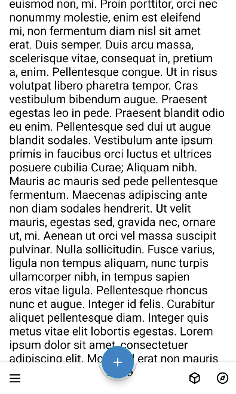

# Nicestart - Proyecto de Desarrollo de Interfaces (Android)

Nicestart es una aplicación Android desarrollada en **Android Studio** y Java
como parte del módulo de **Desarrollo de Interfaces** en 2º de DAM.\
Incluye una arquitectura de varias pantallas, diseño con
ConstraintLayout, navegación entre Activities, uso de AppBar y menús,
carga de imágenes y más.


## 📲 Pantallas/Activities

<table style="width:100%; table-layout:fixed;">
  <tr>
    <th>Splash</th>
    <th>Login</th>
    <th>Signup</th>
    <th>Main</th>
    <th>Main con BAB</th>
    <th>Profile</th>
  </tr>
  <tr>
    <td></td>
    <td></td>
    <td></td>
    <td></td>
    <td></td>
    <td></td>
  </tr>
</table>


## 🛠️ Desarrollo y funcionalidades implementadas

### Splash Screen con animación

La app arranca con una pantalla Splash donde **el logo aparece con una animación** tipo “parpadeo” (`blink`), dando una sensación de entrada dinámica antes de mostrar la pantalla de login.

``` java
ImageView logo = findViewById(R.id.logoSplash);

Animation myAnim = AnimationUtils.loadAnimation(this, R.anim.blink);
logo.startAnimation(myAnim);
```

### Carga de imágenes con Glide

Uso de la **librería Glide** para la gestión de imágenes, que permite cargar recursos de forma eficiente y con mejor rendimiento que de manera estandar.

Dependencia añadida en build.gradle:

``` gradle
implementation 'com.github.bumptech.glide:glide:4.16.0'
```

### Main con AppBar, menú contextual, Swipe Refresh y diálogo modal

La pantalla Main combina e incorpora varias funcionalidades de interfaz para enriquecer la experiencia de usuario:

- **AppBar como barra superior de la aplicación.**

    ```java
    @Override
    public boolean onCreateOptionsMenu(Menu menu) {
        getMenuInflater().inflate(R.menu.menu_appbar, menu);
        return true;
    }
    ```

- **Menú de opciones en la AppBar** (pulsando sale un Toast o un diálogo Modal).

    ```xml
    <menu ...>
        <item
            android:id="@+id/buscar"
            android:icon="@drawable/search"
            android:title="Buscar"
            app:showAsAction="ifRoom" />
        <item
            ... />
    </menu>
    ```

- **Menú contextual** al hacer pulsación larga sobre un elemento de texto.

    ```java
    @Override
    public void onCreateContextMenu(ContextMenu menu, View v, ContextMenu.ContextMenuInfo menuInfo) {
        getMenuInflater().inflate(R.menu.menu_context, menu);
    }
    ```
    ```xml
    <menu ...>
        <item ... />
        <item ... />
    </menu>
    ```


- **Swipe Refresh** para recargar el contenido deslizando hacia abajo (sale un Snackbar).

    ```java
    private SwipeRefreshLayout swipeLayout;

    @Override
    protected void onCreate(Bundle savedInstanceState) {
        ...

        swipeLayout = findViewById(R.id.swipeRefresh);
        swipeLayout.setOnRefreshListener(mOnRefreshListener);
    }

    protected SwipeRefreshLayout.OnRefreshListener
            mOnRefreshListener = new SwipeRefreshLayout.OnRefreshListener() {
        @Override
        public void onRefresh() {
            ...
        }
    };
    ```
- **Diálogo modal** (básico y para ejemplo) al seleccionar una opción del AppBar.

    ```java
    public void showAlertDialogButtonClicked(Main mainActivity) {
        MaterialAlertDialogBuilder builder = new MaterialAlertDialogBuilder(this);
        builder.setTitle("Ejemplo");
        builder.setMessage("Ejemplo de AlertDialog");
        builder.setCancelable(true);

        builder.setPositiveButton(...);
        builder.setNegativeButton(...);
        builder.setNeutralButton(...);

        AlertDialog dialog = builder.create();
        dialog.show();
    }
    ```

### Validación de login con SweetAlert

Para iniciar sesión en la app, se ha añadido una **validación básica**:
el usuario debe introducir `admin` como nombre y `1234` como contraseña.

Según el caso, se muestra un **SweetAlert** informando del resultado:

🟢 Login correcto\
🔴 Credenciales incorrectas\
⚠️ Campos vacíos

Dependencia añadida en build.gradle:

``` gradle
implementation 'com.github.f0ris.sweetalert:library:1.6.2'
```

### Recarga dinámica con WebView

En la pantalla Main utilizamos un **WebView** para mostrar una imagen generada aleatoriamente desde la web [thispersondoesnotexist.com](thispersondoesnotexist.com).
Para evitar incrustar HTML “a capón” en el código Java, hemos movido el contenido a un archivo externo ubicado en `app/src/main/assets/persona.html`.

Carga del HTML en el WebView:
```java
myWebView = (WebView) findViewById(R.id.vistaWeb);

WebSettings webSettings = myWebView.getSettings();
webSettings.setLoadWithOverviewMode(true);
webSettings.setUseWideViewPort(true);

// Carga del archivo HTML almacenado en assets
myWebView.loadUrl("file:///android_asset/persona.html");
```
En el `onRefresh`:
```java
public void onRefresh() {
    myWebView.reload();
```

### Internacionalización (multiidioma)
La app está disponible en **español** (idioma por defecto) e **inglés**, adaptándose automáticamente al idioma configurado en el dispositivo.

Estructura de archivos de los recursos:
``` plaintext
res/
├── values/
│   └── strings.xml        (Español - por defecto)
└── values-en/
    └── strings.xml        (English)
```

### Modo claro/oscuro (Day/Night theme)

Soporte para temas claro y oscuro con adaptación automática a las preferencias del sistema. El cambio manual está en desarrollo.

Los recursos están organizados en:
- **values/colors.xml**: paleta de colores para el tema claro *(por defecto)*
- **values-night/colors.xml**: paleta de colores para el tema oscuro
- **themes.xml**: temas base con soporte para DayNight

### MainBab con BottomAppBar, FAB y BottomSheet

La pantalla MainBab implementa una interfaz moderna con Material Design utilizando un **BottomAppBar** (barra inferior de navegación), un **FloatingActionButton** (FAB) centrado, y un **BottomSheetDialog** que se despliega desde abajo.

Componentes principales:

- **BottomAppBar**: barra inferior con menú de opciones y botón de navegación que abre un BottomSheet.
    ```java
        BottomAppBar bottomAppBar = findViewById(R.id.bottom_app_bar);
        
        bottomAppBar.setOnMenuItemClickListener(new Toolbar.OnMenuItemClickListener() {
            @Override
            public boolean onMenuItemClick(MenuItem item) {
                if (item.getItemId() == R.id.heart) {
                    Toast.makeText(MainBab.this, "Añadido a favoritos", Toast.LENGTH_SHORT).show();
                } else if (item.getItemId() == R.id.search) {
                    Toast.makeText(MainBab.this, "Empezando la busqueda", Toast.LENGTH_SHORT).show();
                }
                return false;
            }
        });
    ```

- **FloatingActionButton (FAB)**: botón flotante anclado al centro del BottomAppBar.
    ```java
        FloatingActionButton myFab = findViewById(R.id.floating_action_button);
        
        myFab.setOnClickListener(new View.OnClickListener() {
            @Override
            public void onClick(View v) {
                Toast.makeText(MainBab.this, "FAB clickado", Toast.LENGTH_SHORT).show();
            }
        });
    ```

- **BottomSheetDialog**: diálogo modal que se despliega al pulsar el icono de navegación del BottomAppBar, mostrando varias opciones.
    ```java
        bottomAppBar.setNavigationOnClickListener(new View.OnClickListener() {
            @Override
            public void onClick(View view) {
                showBottomSheetDialog();
            }
        });

        private void showBottomSheetDialog() {
            View view = LayoutInflater.from(this).inflate(R.layout.bottom_sheet_dialog, null);
            BottomSheetDialog bottomSheetDialog = new BottomSheetDialog(this);
            bottomSheetDialog.setContentView(view);
            bottomSheetDialog.show();

            TextView option1 = view.findViewById(R.id.option1);
            // ...configuración de listeners para cada opción
        }
    ```

## 📂 Estructura del proyecto

``` plaintext
app/
 ├── java/.../nicestart
 │     ├── Login.java
 │     ├── Main.java
 │     ├── MainBab.java
 │     ├── Profile.java
 │     ├── Signup.java
 │     └── Splash.java
 ├── assets/
 │     └── persona.html
 └── res/
       ├── anim/
       ├── color/
       ├── drawable/
       ├── font/
       ├── layout/
       ├── menu/
       ├── mipmap/
       └── values/
```


## 🧑‍💻 Autor

<table>
  <tr>
    <td>
      
    </td>
    <td>
      <strong>Marcos Almorox</strong><br>
      2º DAM - Desarrollo de Interfaces<br>
      <em>IES Juan de la Cierva</em>
    </td>
  </tr>
</table>
