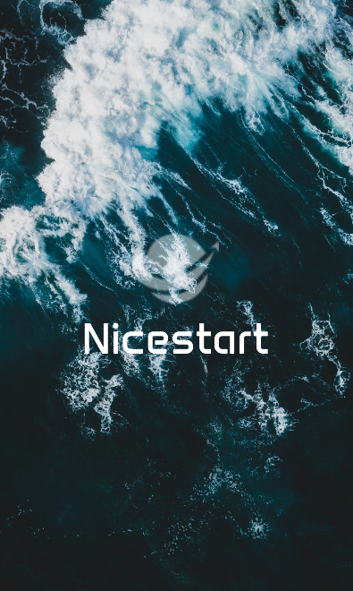
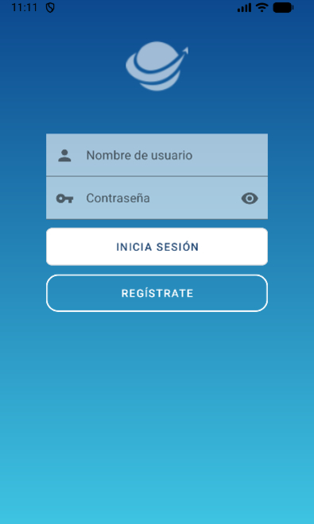
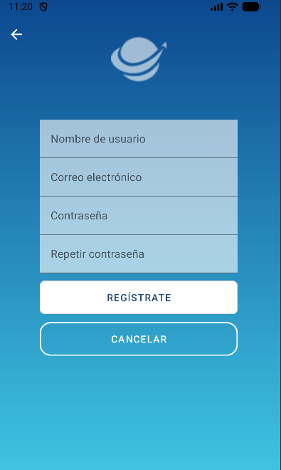
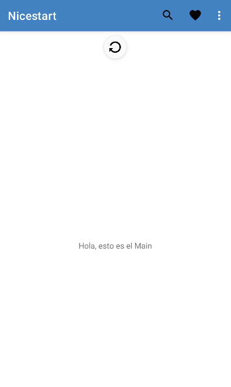

# 📳 Nicestart - Proyecto de Desarrollo de Interfaces (Android)

Nicestart es una aplicación Android desarrollada en **Android Studio** y Java
como parte del módulo de **Desarrollo de Interfaces** en 2º de DAM.\
Incluye una arquitectura de varias pantallas, diseño con
ConstraintLayout, navegación entre Activities, uso de AppBar y menús,
carga de imágenes y más.


## 📲 Pantallas/Activities

<table style="width:100%; table-layout:fixed;">
  <tr>
    <th>Splash</th>
    <th>Login</th>
    <th>Signup</th>
    <th>Main</th>
    <th>Profile</th>
  </tr>
  <tr>
    <td></td>
    <td></td>
    <td></td>
    <td></td>
    <td></td>
  </tr>
</table>


## 🛠️ Desarrollo y funcionalidades implementadas

### Splash Screen con animación

La app arranca con una pantalla Splash donde el logo aparece con una animación tipo “parpadeo” (`blink`), dando una sensación de entrada dinámica antes de mostrar la pantalla de login.

``` java
ImageView logo = findViewById(R.id.logoSplash);

Animation myAnim = AnimationUtils.loadAnimation(this, R.anim.blink);
logo.startAnimation(myAnim);
```

### Carga de imágenes con Glide

Uso de la librería Glide para la gestión de imágenes, que permite cargar recursos de forma eficiente y con mejor rendimiento que de manera estandar.

Dependencia añadida en build.gradle:

``` gradle
implementation 'com.github.bumptech.glide:glide:4.16.0'
```

### Main con AppBar, menú contextual, Swipe Refresh y diálogo modal

La pantalla Main combina e incorpora varias funcionalidades de interfaz para enriquecer la experiencia de usuario:

- AppBar como barra superior de la aplicación.

    ```java
    @Override
    public boolean onCreateOptionsMenu(Menu menu) {
        getMenuInflater().inflate(R.menu.menu_appbar, menu);
        return true;
    }
    ```

- Menú de opciones en la AppBar (pulsando sale un Toast o un diálogo Modal).

    ```xml
    <menu ...>
        <item
            android:id="@+id/buscar"
            android:icon="@drawable/search"
            android:title="Buscar"
            app:showAsAction="ifRoom" />
        <item
            ... />
    </menu>
    ```

- Menú contextual al hacer pulsación larga sobre un elemento de texto.

    ```java
    @Override
    public void onCreateContextMenu(ContextMenu menu, View v, ContextMenu.ContextMenuInfo menuInfo) {
        getMenuInflater().inflate(R.menu.menu_context, menu);
    }
    ```
    ```xml
    <menu ...>
        <item ... />
        <item ... />
    </menu>
    ```


- Swipe Refresh para recargar el contenido deslizando hacia abajo (sale un Snackbar).

    ```java
    private SwipeRefreshLayout swipeLayout;

    @Override
    protected void onCreate(Bundle savedInstanceState) {
        ...

        swipeLayout = findViewById(R.id.swipeRefresh);
        swipeLayout.setOnRefreshListener(mOnRefreshListener);
    }

    protected SwipeRefreshLayout.OnRefreshListener
            mOnRefreshListener = new SwipeRefreshLayout.OnRefreshListener() {
        @Override
        public void onRefresh() {
            ...
        }
    };
    ```
- Diálogo modal (básico y para ejemplo) al seleccionar una opción del AppBar.

    ```java
    public void showAlertDialogButtonClicked(Main mainActivity) {
        MaterialAlertDialogBuilder builder = new MaterialAlertDialogBuilder(this);
        builder.setTitle("Ejemplo");
        builder.setMessage("Ejemplo de AlertDialog");
        builder.setCancelable(true);

        builder.setPositiveButton(...);
        builder.setNegativeButton(...);
        builder.setNeutralButton(...);

        AlertDialog dialog = builder.create();
        dialog.show();
    }
    ```

### SweetAlert

En el login, como extra, se ha integrado un SweetAlert para informar si se ha iniciado sesión correctamente, si las credenciales no son correctas o si hay campos vacios.

Dependencia añadida en build.gradle:

``` gradle
implementation 'com.github.f0ris.sweetalert:library:1.6.2'
```

## 📂 Estructura del proyecto

``` plaintext
app/
 ├── java/.../nicestart
 │     ├── Login.java
 │     ├── Main.java
 │     ├── Profile.java
 │     ├── Signup.java
 │     └── Splash.java
 └── res/
       ├── anim/
       ├── color/
       ├── drawable/
       ├── font/
       ├── layout/
       ├── menu/
       ├── mipmap/
       └── values/
```


## 🧑‍💻 Autor

<table>
  <tr>
    <td>
      
    </td>
    <td>
      <strong>Marcos Almorox</strong><br>
      2º DAM - Desarrollo de Interfaces<br>
      <em>IES Juan de la Cierva</em>
    </td>
  </tr>
</table>
